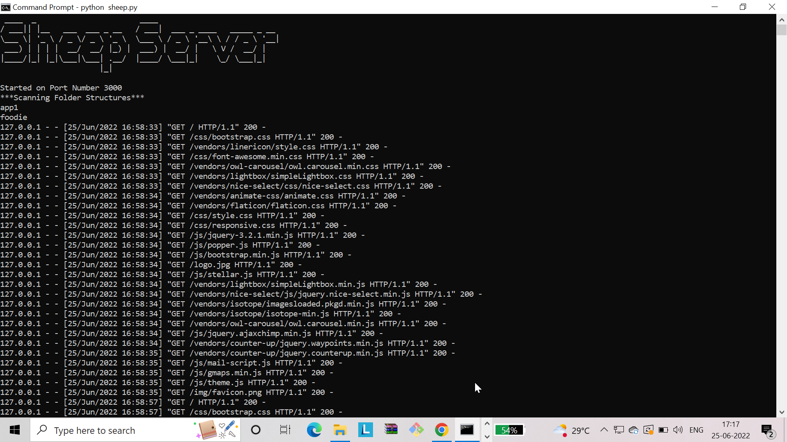
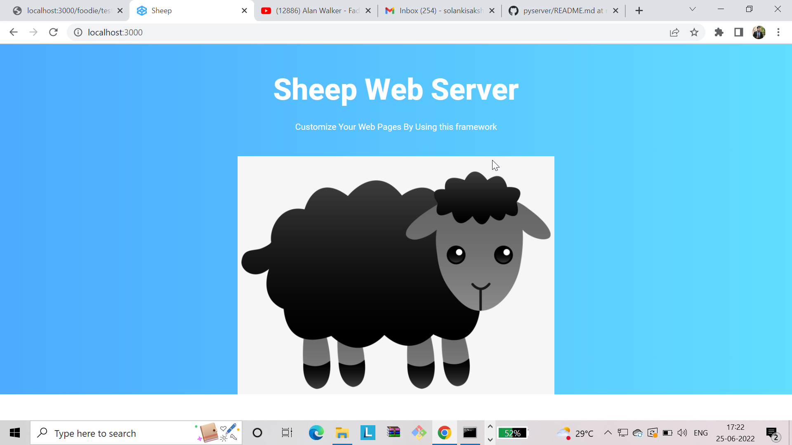

# Sheep

A TCP/IP Based Http Web Server Framework to help developers creating dynamic Web Applications

#### Features
1) Serving Static content like html,css,js,pdf,mp3 and other static mime types
2) A user can create python script to render html content from Server Side (Server Side rendering)
3) Expression Language Support (User can use expression language ${key} to render server side content on Client id),
   for this user has to create .psp(python server pages) extension file and user expression language inside it
4) User can customize server's configuration by creating config.json file in secured folder (config like PORT,HOST)
5) Sheep Supports HTTP/1.1 Protocol,right now it supports only POST and GET requests   

[
[

